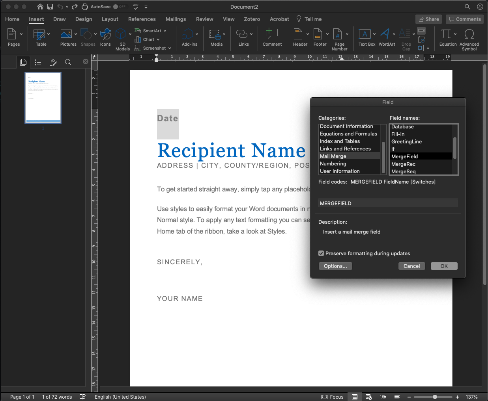
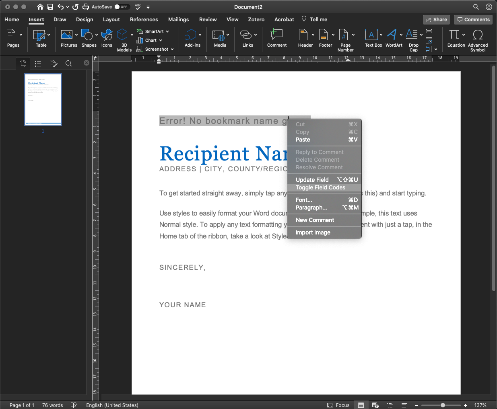

# csv2docx

Generates .docx files from .csv files using a .docx template with mailmerge fields.

## Installing

[Poetry](https://python-poetry.org/) is used for dependency management and
[pyenv](https://github.com/pyenv/pyenv) to manage python installations. Install dependencies via:

    poetry install --no-dev

To setup a virtual environment with your local pyenv version run:

    poetry shell

## Usage

### Library

To import and use the library in your code:

```python
from csv2docx import csv2docx
csv2docx.convert(template="tests/data/example.docx", data="tests/data/example.csv", name="NAME")
```
By default the delimiter is ";", but this can be changed to mirror your CSV file:

```python
csv2docx.convert(template="tests/data/example.docx", data="tests/data/example.csv", name="NAME", delimiter=",")
```

### CLI

Move your `.docx` template and `.csv data file` into the folder of this repo and run:

```shell
poetry run convert -t template.docx -c data.csv -n csv_column_name
```

Where the arguments are your Microsoft Word template, your data to apply to the word template (in .`csv` format) and the column name (case sensitive) to be used to name the resulting `.docx` files.

Optional arguments allow you to indicate a delimiter other than `;` in your `csv` data file, and an ouput folder other than the default `output` in the current directory:

```shell
poetry run convert -t template.docx -c data.csv -n csv_column_name -d ","  # indicate a delimiter if other than ";"
poetry run convert -t template.docx -c data.csv -n csv_column_name -p output_folder  # indicate an output folder
poetry run convert --template template.docx --data data.csv --name csv_column_name --path output_folder --delimiter ","  # long alternative
```

You can also use absolute paths to the files, just make sure you add "" around these for escaping characters, for example:

```shell
poetry run convert --data "path/to/data.csv" --template "path/to/template.docx" --name csv_column_name
```

For help, run

```shell
poetry run convert --help
```

For a demo, run

```shell
poetry run convert -t tests/data/example.docx -c tests/data/example.csv -n NAME
```


## Contributing to code

To contribute to this repository, first install all developer dependencies used (note the ommitted `--no-dev` from above) and set up `pre-commit` by running:

```shell
poetry install
poetry run pre-commit install
```

Run linting and tests to see if all went well:

```shell
poetry run nox -r
```

[Nox](https://nox.thea.codes/) is used for automation and standardisation of tests, type hints, automatic code formatting, and linting. Any contribution **needs to pass these tests** before creating a Pull Request. The command above will check code formatting (using `flake8`), dependency safety and unit tests (using [`pytest`](https://docs.pytest.org/en/latest/) and [`coverage`](https://coverage.readthedocs.io/)).

With [`pre-commit`](https://pre-commit.com/) set up as above, any code committed will be run past a few tests, see the [`pre-commit` configuration file](.pre-commit-config.yaml). You can also run these test without a commit using:

```shell
poetry run pre-commit run --all-files
```

### Pull requests
When submitting a pull requests (e.g. using your fork of this repo), your code must be accompanied by corresponding tests by creating a new file (e.g. `test_new_function.py`) in [tests/data](tests/data). If tests are not present your code will not be merged.

## Demo and preparing your files
This demo uses 'Business Letter' template from Microsoft Office Word. In Word, open your desired document, and add mergefields in place where you like to fill the data programmatically. In the "Insert" ribbon, click on "[ ] Field" (likely next to text box or WordArt) and choose MailMerge --> MergeField.



In my case, it showed `Error! No bookmark name given`. Right click on the text, "toggle field codes".



You should see something like this `{ MERGEFIELD \* MERGEFORMAT}`. Add a name for this field, like so `{ MERGEFIELD DATE \* MERGEFORMAT}`. This name will have to correspond exactly (case sensitive) to the header in your .csv file. When you right click -- update field, the field should now display something like `<<DATE>>`. Make sure you update this field to the correct styling as you like. You can add more fields following the same approach, or copy paste this field and edit its name using the toggle-field trick.
