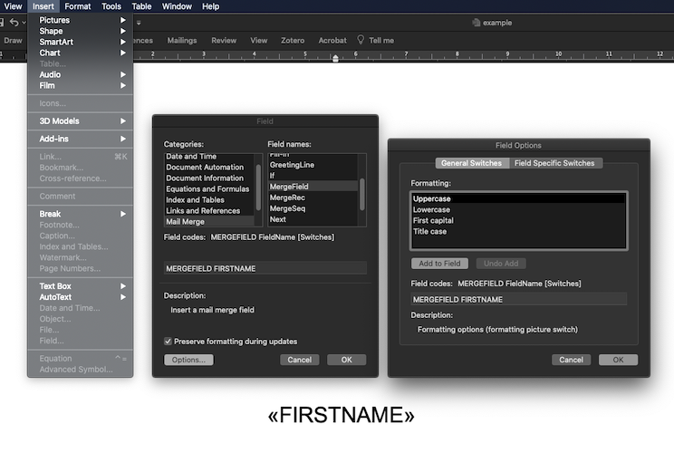

# csv2docx

Generates .docx files from .csv files using a .docx template with mailmerge fields.

## Installing

[Poetry](https://python-poetry.org/) is used for dependency management and
[pyenv](https://github.com/pyenv/pyenv) to manage python installations. Install dependencies via:

    poetry install --no-dev

To setup a virtual environment with your local pyenv version run:

    poetry shell

## Usage
Microsoft Word is used to generate the `.docx` and should be installed on your machine.

### Library

To import and use the library in your code:

```python
from csv2docx import csv2docx
csv2docx.convert(template="tests/data/example.docx", data="tests/data/example.csv", name="NAME")
```
By default the delimiter is ";", but this can be changed to mirror your CSV file:

```python
csv2docx.convert(template="tests/data/example.docx", data="tests/data/example.csv", name="NAME", delimiter=",")
```

#### Exceptions

The `.convert()` methods returns `True` when successful, and throws a `KeyError` or `ValueError` if a (resolved) argument is found not to be valid.

### CLI

```shell
poetry run convert --data "path/to/data.csv" --template "path/to/template.docx" --name csv_column_name
```

Where the arguments are your Microsoft Word template (`.docx`), your data to apply to the template (`.csv`) and the column name (case sensitive) to generate filenames for the output `.docx` files. Optional arguments allow you to indicate a delimiter other than `;` in your `csv` data file, and an ouput folder other than the default `output` in the current directory:

```shell
poetry run convert -t template.docx -c data.csv -n csv_column_name -d ","  # indicate a delimiter if other than ";"
poetry run convert -t template.docx -c data.csv -n csv_column_name -p output_folder  # indicate an output folder
poetry run convert --template template.docx --data data.csv --name csv_column_name --path output_folder --delimiter ","  # long alternative
```

For help, run

```shell
poetry run convert --help
```

For a demo, run

```shell
poetry run convert -t tests/data/example.docx -c tests/data/example.csv -n NAME
```

## Prepare your `.docx` template and `.csv` data file

In your Microsoft Word `.docx` document of choice, used the menu bar to navigate to `Insert` and select `Field`. Choose the `Mail Merge` category, and the `MergeField` name. Next to the field code showing `MERGFIELD` enter the name of the data that should go here (e.g. a column name if already known). For example, `MERGEFIELD FIRSTNAME`. Under options, you can set additional formatting, such as capitalisation. In the document you should now see your field as **\<\<FIRSTNAME\>\>** Keep adding fields as necessary, making sure each field has a unique name. See [Microsoft's documentation](https://support.microsoft.com/en-gb/office/insert-edit-and-view-fields-in-word-c429bbb0-8669-48a7-bd24-bab6ba6b06bb) for more details.

In your `.csv` data file, ensure that each field in the `.docx` template is represented by a column in the column header and **CAPITALISED**.



## Contributing to code

To contribute to this repository, first install all developer dependencies used (note the ommitted `--no-dev` from above) and set up `pre-commit` by running:

```shell
poetry install
poetry run pre-commit install
```

Run linting and tests to see if all went well:

```sh
$ poetry run nox -r
```

[Nox](https://nox.thea.codes/) is used for automation and standardisation of tests, type hints, automatic code formatting, and linting. Any contribution **needs to pass these tests** before creating a Pull Request. The command above will check code formatting (using `flake8`), dependency safety and unit tests (using [`pytest`](https://docs.pytest.org/en/latest/) and [`coverage`](https://coverage.readthedocs.io/)).

With [`pre-commit`](https://pre-commit.com/) set up as above, any code committed will be run past a few tests, see the [`pre-commit` configuration file](.pre-commit-config.yaml). You can also run these test without a commit using:

```shell
poetry run pre-commit run --all-files
```

### Pull requests
When submitting a pull requests (e.g. using your fork of this repo), your code must be accompanied by corresponding tests by creating a new file (e.g. `test_new_function.py`) in [/tests/](/tests). If tests are not present your code will not be merged.
